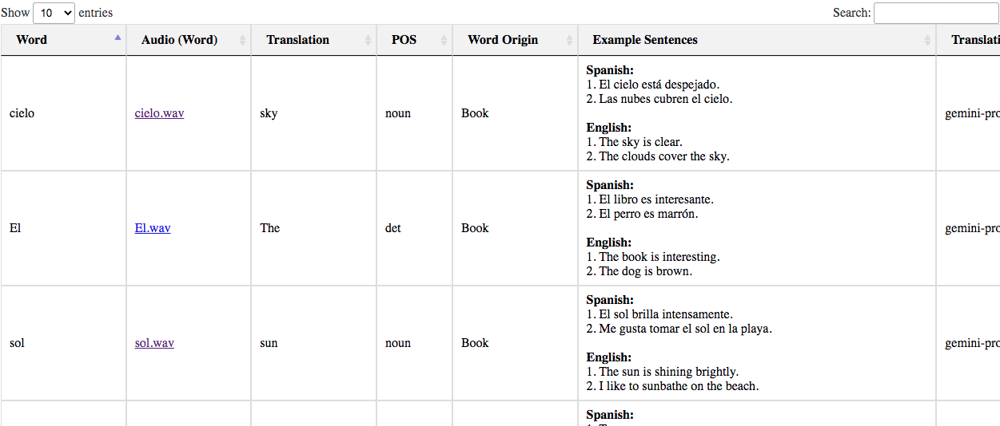
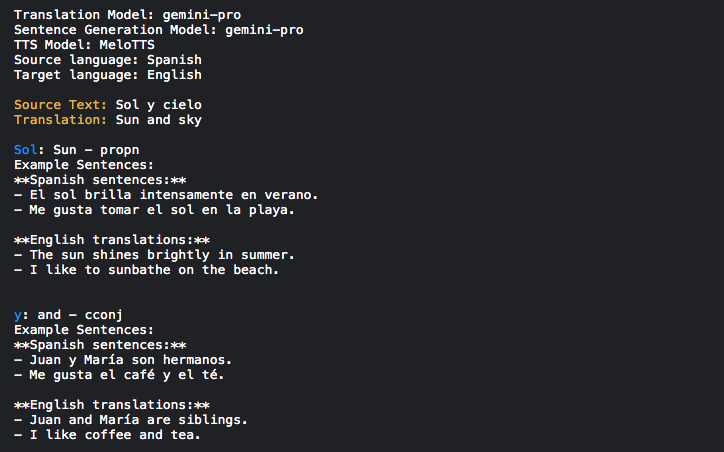

# vocab-augmentor v0.1.0-beta
## Overview

**vocab-augmentor** is a Python tool designed to help language learners expand their vocabulary 
effortlessly. By leveraging advanced language models such as `facebook/mbart-large-50-many-to-many-mmt`, 
`Helsinki-NLP/opus-mt`, `Gemini 1.0 Pro`, and `llama 3-8b`, this tool identifies new words from any 
given text, translates them, and updates your personal vocabulary table. Additionally, it supports 
adding pronunciation sounds for new words using the `MeloTTS` and `facebook/mms-tts-por` text-to-speech 
libraries for supported languages. The updated vocabulary table is then exported to a CSV file and a 
feature-rich HTML file for easy access and further study.



> HTML table displaying words extracted from source text, including translation data, audio links,
> and part of speech (POS)

## Features

- **Multi-Language Support**: Supports a variety of languages, making it versatile
  for learners of different languages.
- **Advanced Translation Models**: Choose from multiple state-of-the-art translation
  models for accurate translations.
  - `facebook/mbart-large-50-many-to-many-mmt`
  - `Helsinki-NLP/opus-mt`
  - `Gemini 1.0 Pro`
  - `llama 3-8b`
- **Audio Pronunciation**: Adds pronunciation sounds for new words using `MeloTTS` for
  supported languages, including English, French, Spanish, Chinese, Korean, and Japanese.

  For Portuguese text-to-speech, `facebook/mms-tts-por` is used. Sound files are
  saved as `.wav.`
- **Example Sentence Generation**: Generates two example sentences for each segmented
  word using one of the large language models (`Gemini 1.0 Pro` or `llama 3-8b`). 
- **Selective Module Installation**: Modules are installed only when needed for
  specific tasks.
- **CSV and HTML Export**: Updates and exports the vocabulary table to a CSV file
  and a feature-rich HTML file.
  - HTML features include `DataTables` stylesheet, column reordering, resizable
    columns, search functionality, pagination, and sortable columns.
  - Both CSV and HTML files include clickable links to audio files (`.wav`)
    containing pronunciation sounds of extracted words.
  - Saves new words along with comprehensive data including their translation,
    pinyin (if applicable), part of speech (POS), and example sentences.

## Dependencies

### Requirements

- **Platform**: tested on Linux
- **Python**: version 3.10.3+
- `langcodes`: to get the full name of a language from its short code

### Selective Module Installation

Modules are installed automatically by the `vocab` script only when needed for specific 
tasks. Below is a breakdown of the modules required based on different functionalities:

| Functionality | Required Modules |
|---|---|
| Translation Models | - **facebook/mbart-large-50-many-to-many-mmt** (`transformers`) <br> - **Helsinki-NLP/opus-mt** (`transformers`) |
| Translation & Sentence Generation | - **gemini-pro** (`google.generativeai`) <br> - **meta-llama/Meta-Llama-3-8B-Instruct** (`huggingface_hub`, `torch`, `transformers`) |
| Text-to-Speech (TTS) | - **facebook/mms-tts-por** (`transformers`, `torch`, `scipy`, `numpy`) <br> - **MeloTTS** (`gradio_client`) |
| Language Detection | - `langdetect` <br> - `langid` <br> - `polyglot` (`pyicu`, `pycld2`) |
| Language-Specific | - Chinese (source/target): `pypinyin` |
| Data Management | - Saving translations to CSV: `pandas` |
| Text Segmentation | - Chinese: `jieba` <br> - Other languages: `spacy` |

Note: When using GPU T4 with **polyglot**, `pycld3` can't be installed, 
hence **polyglot** can't be used. Use an alternative detection method 
in such cases (e.g. `langdetect` or `langid`).

## Installation ⭐

Install the package `vocab_augmentor` with `pip`:
```terminal
pip install git+https://github.com/raul23/vocab-augmentor/#egg=vocab-augmentor
```

**Test installation**

1. Test your installation by importing `vocab_augmentor` and printing its version:
   ```terminal
   python -c "import vocab_augmentor; print(vocab_augmentor.__version__)"
   ```
2. You can also test that you have access to the `vocab` script by
   showing the program's version:
   ```terminal
   vocab --version
   ```
    
## API Key Management

To utilize the advanced translation and text generation features of
`Gemini 1.0 Pro` and `llama 3-8b`, API keys are required. These keys must be
saved as environment variables. Follow the steps below to manage your API keys:

### Setting Up Environment Variables

1. **Gemini 1.0 Pro API Key**
   - Save your Gemini 1.0 Pro API key as an environment variable named `GEMINI_API_KEY`.
   - In a Unix-based system (Linux, macOS), add the following line to your `.bashrc`
     or `.zshrc` file:
     ```sh
     export GEMINI_API_KEY='your_gemini_api_key'
     ```

2. **Hugging Face API Key for Llama 3-8b**
   - Save your Hugging Face API key as an environment variable named `HF_API_KEY`.
   - In a Unix-based system, add the following line to your `.bashrc` or `.zshrc` file:
     ```sh
     export HF_API_KEY='your_hugging_face_api_key'
     ```

### Important Notes

- Ensure your API keys are kept confidential and not shared publicly.
- Using API keys allows the script to access powerful language models and 
  generate accurate translations and text examples efficiently.

By following these steps, you can seamlessly integrate API keys into the 
`vocab` script and leverage its full capabilities for advanced language 
learning tasks.

## Performance Recommendations
    
- **GPU Recommendation**: When using `llama 3-8b`, GPU usage is highly recommended 
  for faster processing.
  
- **Text Generation**: Use either `Gemini 1.0 Pro` or `llama 3-8b` to generate
  example sentences.
  - `Gemini 1.0 Pro` is faster as it uses an API.

## Usage

### Script options ⭐

To display the `vocab` script list of options and their descriptions:
```terminal
usage: vocab [OPTIONS] {TEXT} {TGT_LANG}

Expand your vocabulary list by identifying and translating new words from provided text using various language models.

options:
  -v, --version                       Show program's version number and
                                      exit.
  -h, --help                          Display detailed usage instructions
                                      and exit the program.
  -t, --text TEXT                     The source text that will be
                                      processed to identify and translate
                                      new words.
  -l, --target_lang TGT_LANG          Target language code into which the
                                      source text will be translated (e.g.,
                                      zh for Chinese, en for English, pt
                                      for Portuguese).
  -o, --text_origin ORIGIN            Origin of the source text, e.g. movie
                                      script, book, URL of website, etc.
  -d, --lang_detector NAME            Method to use for detecting the
                                      language of the source text.
                                      (default: polyglot)
  -m, --transl_model NAME             Translation model to use for
                                      translating the text.
                                      (default: helsinki)
  -g, --gen_model NAME                Language model to use for generating
                                      example sentences in the source
                                      language. (default:
                                      gemini)
  -c, --csv_filepath CSV_FILE         Path to the vocabulary CSV file. If
                                      the file does not exist, a new one
                                      will be created.
  -a, --audio_dirpath AUDIO_DIR       Path to the main directory for
                                      storing audio files. (default:
                                      ~/audio/)
  -b, --audio_base_url URL            Base URL to audio files of words.
                                      (experimental)
  --ap, --add_pos                     Flag to add or update part-of-speech
                                      (POS) information for the words.
  --as, --add_sentences               Flag to add or update example
                                      sentences in the vocabulary list.
  --aut, --add_audio_text             Flag to add or update audio
                                      pronunciation for the source text.
  --aaw, --add_audio_words            Flag to add or update audio
                                      pronunciation for the extracted words
                                      from the text.
  --ascb, --add_save_comments_button  Flag to add 'Save Comments' button in
                                      the HTML page of the table.
                                      (experimental)
```

### Run the script `vocab` ⭐

1. Run the script:
   ```terminal
   vocab -t 'Sol y cielo' -l en -m gemini --ap --as --aaw
   ```

   **NOTES**:
   - `-t 'Sol y cielo'`: the source text to be translated from Spanish to English (`-l en`)
   - `-m gemini`: the `Gemini 1.0 Pro` model is used for translation from Spanish to English
   - `--ap`: Part-of-Speech (POS) tags will be added for each segmented word from the source text
   - `--as`: Two example sentences will be generated for each segmented word from the source text
   - `--aaw`: Audio pronounciations will be generated for each segmented word from the source text

3. The script will create an `audio/` directory (if it doesn't already exist) and save the
   audio files there. The CSV and HTML files will include clickable links to these audio files.



> Terminal output showing new words extracted from the source text and the sentence examples
> generated by `Gemini 1.0 Pro` 

### Example CSV Structure

The CSV file might have the following structure:

| Word | Pinyin | Translation | POS  | Audio (Word)                      |
|------|--------|--------------|------|----------------------------------|
| 新词  | xīn cí | New word     | noun | [xinci.wav](file:///path/to/audio/xinci.wav) |
| 例子  | lì zi  | Example      | noun | [lizi.wav](file:///path/to/audio/lizi.wav)  |


## Known Issues and Limitations

- **Language detection**: When running the script on a GPU T4 and selecting
  `polyglot` for automatic language detection, `pycld3` can't be installed,
  hence `polyglot` can't be used. Use an alternative language detection method
  in such cases (e.g. `langid` or `langdetect`).
- **Chinese Text-to-Speech:** For Chinese text, `MeloTTS` may have difficulties
  with single-character words and low volume on some words.
  - Spanish TTS is good except for very small words like "y".

## Contributing

[Contributions](https://github.com/raul23/vocab-augmentor/pulls) are welcome!

## License

This project is licensed under the MIT License. See the [LICENSE](LICENSE) file for details.

## Acknowledgments

- Special thanks to the developers of the language models and `MeloTTS` used in this project.
- Inspired by the need to make language learning more efficient and effective.
